# Posh Pawpy

Posh Pawpy is a website for pet owners that are seeking dog grooming services.

To see the live version of the site click [here](https://nweying.github.io/poshpawpy/index.html)!

## CONTENTS

* [User Experience (UX)](#User-Experience-UX)
  * [User Stories](#User-Stories)

* [Design](#Design)
  * [Colour Scheme](#Colour-Scheme)
  * [Typography](#Typography)
  * [Imagery](#Imagery)
  * [Wireframes](#Wireframes)

* [Features](#Features)
    * [Accessibility](#Accessibility)

* [Technologies Used](#Technologies-Used)
  * [Languages Used](#Languages-Used)
  * [Frameworks, Libraries & Programs Used](#Frameworks-Libraries--Programs-Used)

* [Deployment & Local Development](#Deployment--Local-Development)
  * [Deployment](#Deployment)
  * [Local Development](#Local-Development)
    * [How to Fork](#How-to-Fork)
    * [How to Clone](#How-to-Clone)

* [Testing](#Testing)
  * [Testing User Stories](#Testing-User-Stories-from-User-Experience-UX-Section)
  * [HTML Validation](#HTML-Validation)
  * [CSS Validation](#CSS-Validation)
  * [Lighthouse](#Lighthouse)
  * [Browser Compatability & Responsiveness](#Browser-Compatability--Responsiveness)
  * [Bugs](#Bugs--Fixes)

* [Credits](#Credits)
  * [Code Used](#Code-Used)
  * [Content](#Content)
  * [Media](#Media)
  * [Acknowledgments](#Acknowledgments)

- - -

## User Experience (UX)

### Target Audience

* Dog owners residing in or near London who seek professional grooming services for their pets.
* Individuals looking for a modern and stylish dog grooming service.
* Customers interested in a personalized grooming experience tailored to their dog's specific needs and preferences.

### User Stories

#### First Time Visitor Goals

* As a first time visitor, I want to understand what kind of business Posh Pawpy is.
* As a first time visitor, I want to easily navigate through the website to find essential information such as contact details and location.
* As a first time visitor, I want to learn about the services offered by Posh Pawpy.
* As a first time visitor, I want to find testimonials from satisfied customers.
* As a first time visitor, I want to easily contact Posh Pawpy with questions I might have.

#### Returning Visitor Goals

* As a returning visitor, I want to schedule more grooming appointments.
* As a returning visitor, I want to explore the gallery section to view images of previous grooming sessions.
* As a returning visitor, I want to provide feedback or testimonials to Posh Pawpy.

#### Frequent Visitor Goals

* As a frequent visitor, I want to stay updated on any new services, or changes to the pricing.
* As a frequent visitor, I want to connect with Posh Pawpy through social media channels.

- - -

## Design

### Colour Scheme

Throughout the Posh Pawpy website and also for the logo, I used a palette of pastel colors in order to radiate warmth and friendliness. The colour palette was created using the [Color Hunt](https://colorhunt.co/) website.

### Typography

Poppins from Google Fonts is used as the primary font for all the headings and body text throughout the website due to its clean and modern appearance as well as its readability.

### Imagery

All images used including hero images, logo, icons, gallery images were taken from online platforms which have been credited in the [credits](#Credits) section.

Posh Pawpy Logo

### Wireframes

Wireframes were developed for mobile, tablet, and desktop devices, ensuring good user experience across various screen sizes.

**Home Page:**

**Services Page:**

**Contact Us Page:**

## Features

The website consists of four pages, with three accessible directly from the navigation menu: home, services, and contact us. The fourth page serves as a thank you page, appearing automatically when a user submits a form on the contact us page.

* Header and Footer

  * **Responsive Navigation Bar**: Positioned on the top-left of the screen, the logo and navigation bar adapt to different screen sizes. On larger screens, they maintain a clean alignment to the left, whereas on smaller devices, they are centered and stacked for improved usability. The active page is denoted by bold and underlined text on the navigation bar, while hovering over each menu item highlights the links for enhanced user interaction. The navigation bar remains fixed at the top of the screen, ensuring easy access as users scroll through the page.

  * **Footer with Business Info and Social Media Links**: Divided into two sections, the footer offers important details about Posh Pawpy, including business address, phone number, map location, and operating hours in the first section, each highlighted with corresponding icons. In the second section, copyright information along with clickable social media links for Facebook, Twitter, YouTube, and Instagram are displayed, further enhancing user engagement.

* Home Page
  * **Hero Section**: This section greets visitors with a hero image and a welcome message that introduces Posh Pawpy's premier dog grooming service. 
  * **About Us**: A bigger version of the logo is dislpayed alongside a description of "Who We Are" as a business. On larger screens, the logo and description are arranged in a row, while on mobile devices, they stack vertically for better readability.
  * **Testimonials**: This section showcases feedback from previous customers, accompanied by images of their dogs. Each testimonial provides insights into the positive experiences clients have had with Posh Pawpy's grooming services.

* Services Page
  * **Hero Section**: There is another hero image and cover text that lets the user know that the page will provide information on grooming services available at Posh Pawpy.
  * **Services & Pricing**: Presents key services first, highlighting day care and overnight options with pricing tiers based on the weight of the dog. Below that, a detailed table displays additional services, categorized by dog weight, with corresponding pricing variations. The table format adjusts seamlessly, appearing horizontally on larger screens and vertically on smaller devices.
  * **Gallery**: Features a selection of images showcasing dogs undergoing grooming treatments at Posh Pawpy.

* Contact Page
  * **Form**: The contact form features fields for the user's name, email address, and a text area for additional information. A submit button is placed below the fields. The name and email fields are mandatory, ensuring necessary details are provided for successful form submission. A helpful tooltip prompts users to fill in any missing information before submission.

* Thank You Page
  * Upon form submission, a thank you message acknowledges the user's action and assures them of a response within 24 hours.

### Accessibility

The website follows accessability guidelines, ensuring inclusivity for all users.

* Implementation of semantic HTML to enhance screen reader compatibility and navigation.
* Inclusion of descriptive alt attributes for images to facilitate understanding for visually impaired users.
* Thoughtful selection of color schemes and font styles to ensure readability and ease of use for all visitors.

## Technologies Used

### Languages Used

- HTML
- CSS

### Frameworks, Libraries & Programs Used

- Bootstrap Version 5.3.3 - The framework provided code assist with the responsiveness and styling of the website.

- Balsamiq - To create wireframes for all pages.

- Font Awesome - For the iconography on the website.

- Git - For version control.

- Gitpod - To write code for the website.

- Github - To save and store the files for the website.

- Google Fonts - To import the fonts used on the website.

- Google Dev Tools - To test and troubleshoot features, and assist with responsiveness and styling.

- [Adobe Express](https://www.adobe.com/express/) To resize images.

- [Am I Responsive?](http://ami.responsivedesign.is/) To show the website images on a range of devices.

- [Freepik](https://www.freepik.com/) and [Vectezzy](https://www.vecteezy.com/) For all images used in website.

- [Wepik](https://favicon.io/) To edit the logo styling.

- - -

## Deployment & Local Development

### Deployment

Github Pages was used to deploy the live website. The instructions to achieve this are below:

1. Log in (or sign up) to Github.
2. Find the repository for this project, [PoshPawpy Github](https://github.com/nweying/poshpawpy).
3. Click on the Settings link.
4. Click on the Pages link in the left hand side navigation bar.
5. In the Source section, choose main from the drop down select branch menu. Select Root from the drop down select folder menu.
6. Click Save. Your live Github Pages site is now deployed at the URL shown.

### Local Development

#### How to Fork

To fork the Posh Pawpy repository:

1. Log in (or sign up) to Github.
2. Go to the repository for this project, [PoshPawpy Github](https://github.com/nweying/poshpawpy).
3. Click the Fork button in the top right corner.

#### How to Clone

To clone the Posh Pawpy repository:

1. Log in (or sign up) to GitHub.
2. Go to the repository for this project, [PoshPawpy Github](https://github.com/nweying/poshpawpy).
3. Click on the code button, select whether you would like to clone with HTTPS, SSH or GitHub CLI and copy the link shown.
4. Open the terminal in your code editor and change the current working directory to the location you want to use for the cloned directory.
5. Type 'git clone' into the terminal and then paste the link you copied in step 3.
6. Press Enter. Your local clone will be created.

## Testing

### Testing User Stories from User Experience (UX) Section

All user stories for first-time, returning, and frequent visitors have been thoroughly tested and validated for functionality and user experience.

-   #### First Time Visitor Goals

    1. As a first time visitor, I want to understand what kind of business Posh Pawpy is.

        1. Upon entering the site, users can immediately see a hero section featuring a welcoming message and a hero image, offering an initial glimpse into the business. Directly below, users encounter a distinctive logo presentation and an "About Us" section, facilitating a deeper understanding of the business's nature and ethos.

        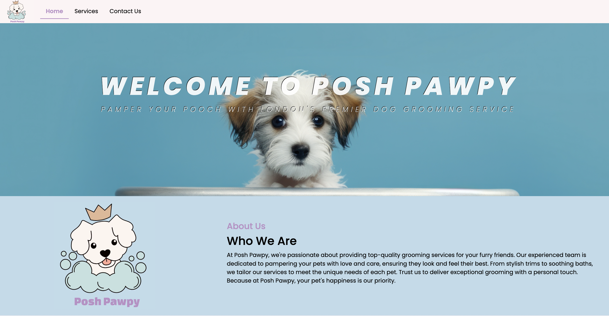
    
    2. As a first time visitor, I want to easily navigate through the website to find essential information such as contact details and location.

        1. The navigation bar fixed at the top of each page allows first-time visitors to easily explore different sections of the website. Contact details and operating hours are conveniently located in the footer section on every page for quick access.

        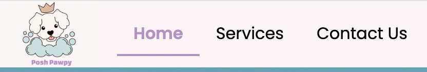

        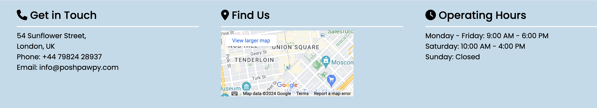

    3. As a first time visitor, I want to learn about the services offered by Posh Pawpy.

        1. Upon selecting the "Services" page from the navigation bar, users are directed to a page displaying the services available, along with a clear pricing structure presented in a table format for enhanced readability.

        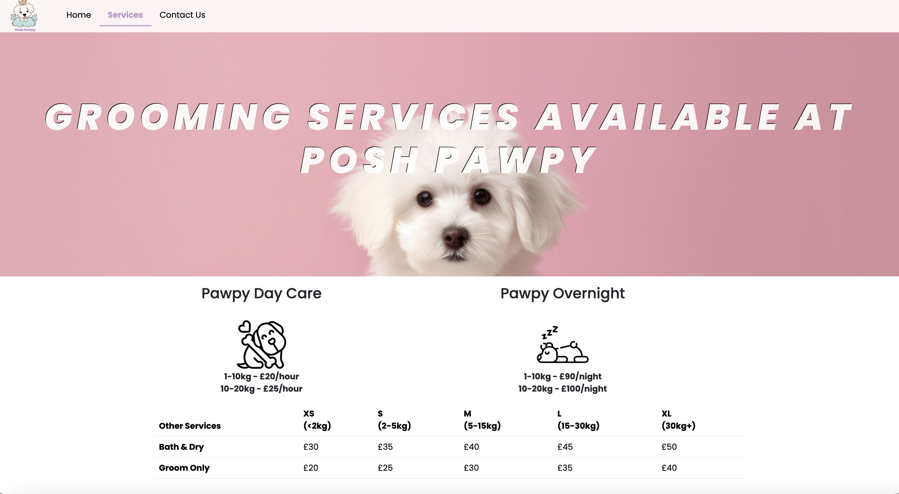

    4. As a first time visitor, I want to find testimonials from satisfied customers.

        1. First-time visitors can find testimonials from satisfied customers in the home page, which provide insights into the quality of service provided by Posh Pawpy.

        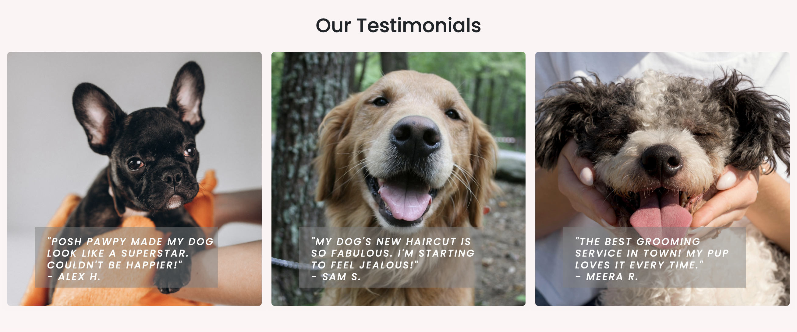

    5. As a first time visitor, I want to easily contact Posh Pawpy with questions I might have.

        1. By scrolling down to the footer, users can see contact details and operating hours on every page. Additionally, the contact form on the "Contact Us" page allows users to reach out to Posh Pawpy with any inquiries.
        
        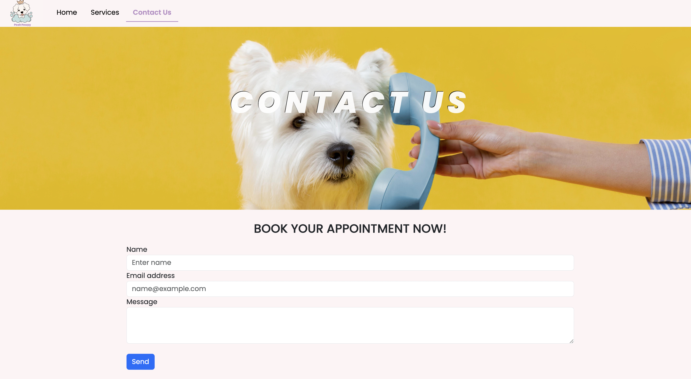

-   #### Returning Visitor Goals

    1. As a returning visitor, I want to schedule more grooming appointments.

        1. Returning users can schedule grooming appointments by accessing the contact form on the "Contact Us" page.

    2. As a returning visitor, I want to explore the gallery section to view images of previous grooming sessions.

        1. When users scroll down on the "Services" page, there is a gallery section showcasing images of previous grooming sessions, allowing returning users to explore Posh Pawpy's work.

        

    3. As a returning visitor, I want to provide feedback or testimonials to Posh Pawpy.

        1. Users that want to provide feedback can contact Posh Pawpy using the contact information in the footer or the contact form.

-   #### Frequent Visitor Goals

    1. As a frequent visitor, I want to stay updated on any new services, or changes to the pricing.

        1. A frequent user can stay up to date on services and pricing by navigating the "Services" page and looking at the pricing table.

    2. As a frequent visitor, I want to connect with Posh Pawpy through social media channels.

        1. Users can scroll down to the bottom of every page to access Posh Pawpy's social media channels which are presented as as clickable links.

        

### W3C Validator

The W3C Markup Validator and W3C CSS Validator Services were used to validate every page of the project to ensure there were no syntax errors in the project.

### HTML Validation
 

Home

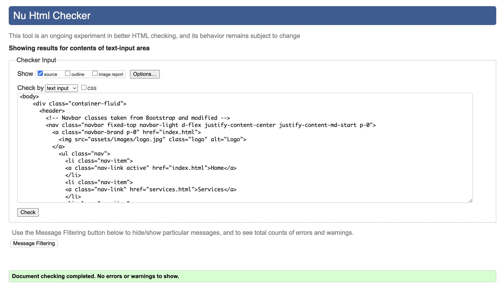

Services

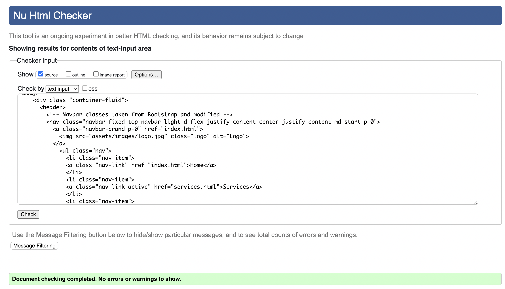

Contact

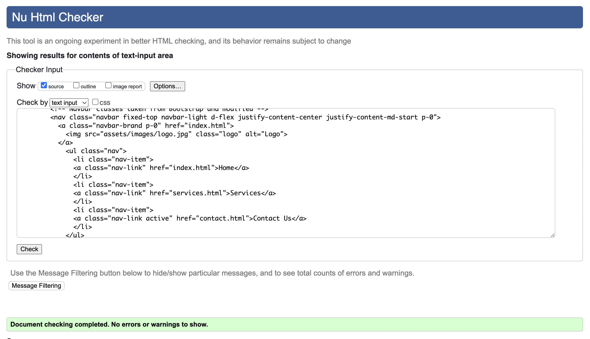

Thank You

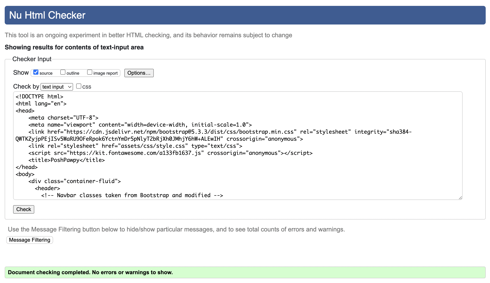

### CSS Validation

style.css

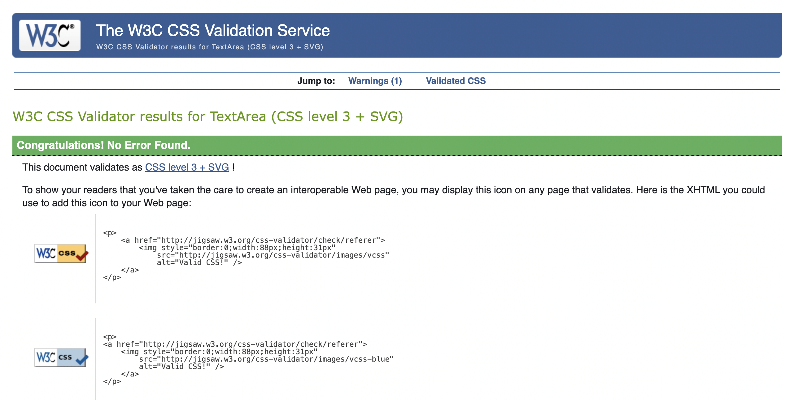

### Lighthouse

Lighthouse within Chrome Developer Tools was used to test performance on desktop and mobile.

#### Desktop

Home

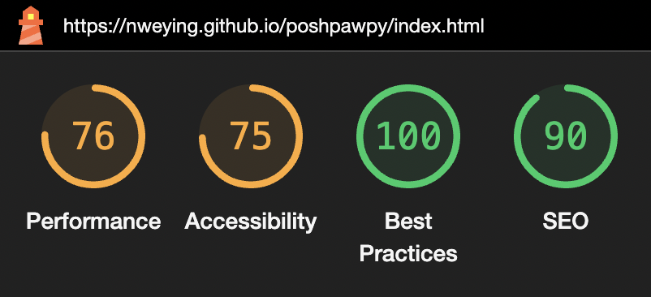

Services

Contact

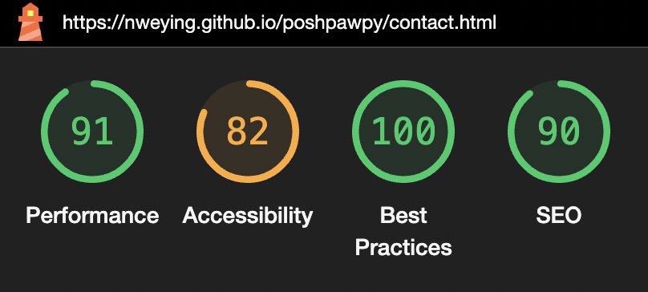

Thank You

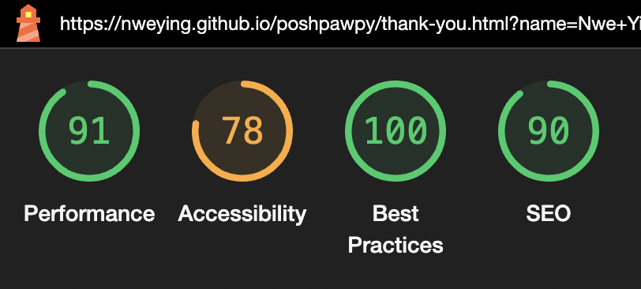

#### Mobile

Home

Services

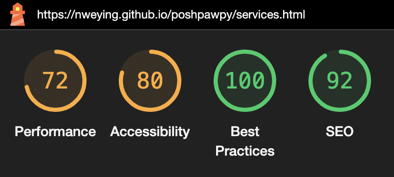

Contact

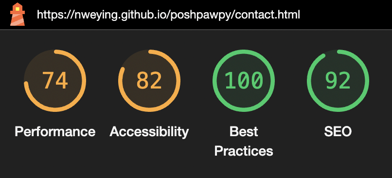

Thank You

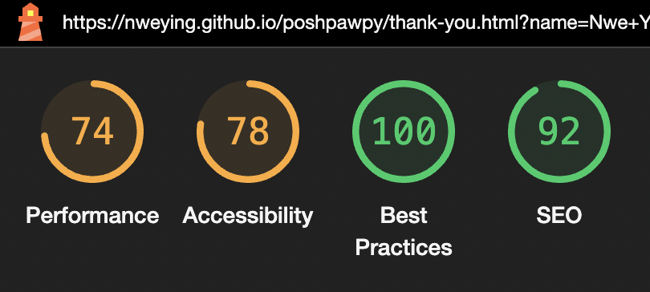

### Browser Compatability & Responsiveness

The website was tested on the following browsers:

- Google Chrome
- Mozilla Firefox
- Microsoft Egde
- Safari

The website underwent thorough responsiveness testing using Google Dev Tools across various screen sizes. CSS media queries and the Bootstrap grid system were extensively used throughout to guarantee that the layout adjusts seamlessly, maintaining the structural integrity of the pages across all device screen sizes.

## Bugs & Fixes

| **Bug** | **Fix** |
| ----------- | ----------- |
| Horizontal scroll appearing at the bottom of all pages | Set both left and right margin of the row to zero |
| Testimonial texts overlapping in smaller screen sizes | Updated media query and adjusted text positioning in CSS |
| Testimonial images stretching | Removed unnecessary CSS rule defining image dimensions |
| Map and Operating Hours in footer overlapping in medium screen sizes | Set up additional media query for medium screen sizes, adjusted map width, reduced  text font size |
| Images not appearing on deployed site | Corrected relative file path to ensure proper image display |
| Service and pricing table not responsive on smaller screen sizes | Created a vertical table specifically for smaller screens where the original horizontal table is hidden |

## Credits

### Code

-   Code for gallery layout using flexbox taken from [CSS Tricks](https://css-tricks.com/adaptive-photo-layout-with-flexbox/) shared by my mentor.

-   [Bootstrap 5.3](https://getbootstrap.com/docs/5.3/getting-started/download/) Library used throughout the project mainly to make site responsive using the Bootstrap Grid System.

### Content

-   All content was written by the developer.

### Media

-   All Images were taken from [Freepik](https://www.freepik.com/) and [Vectezzy](https://www.vecteezy.com/).

### Acknowledgements
I would like to thank:
- My mentor Mitko for his guidance and feedback throughout the whole project.
- My Cohort Facilitator Kristyna for the tips and support given out weekly.
- To Tutor Support and Student Care for prompt support on any issues I faced.
- To the CI Slack Community for advice and recommendations.